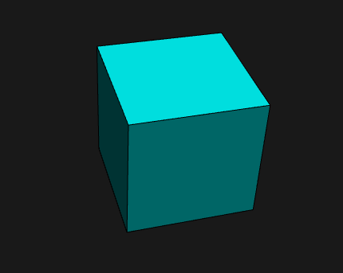
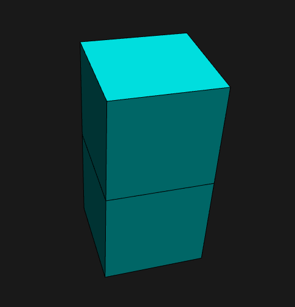
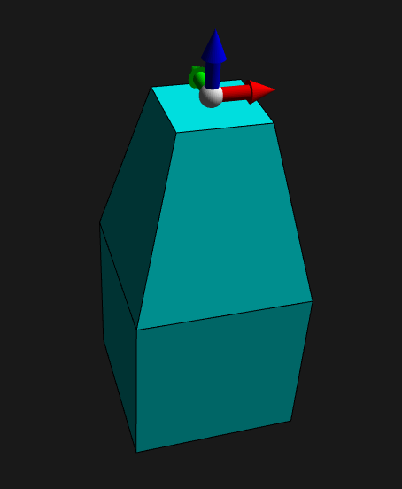
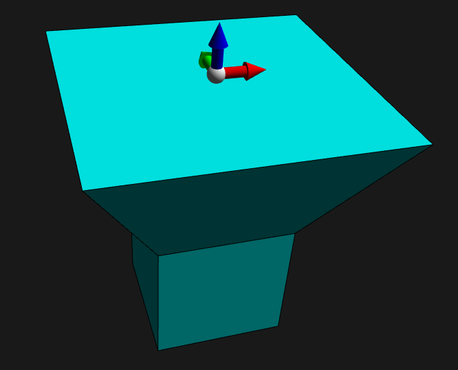
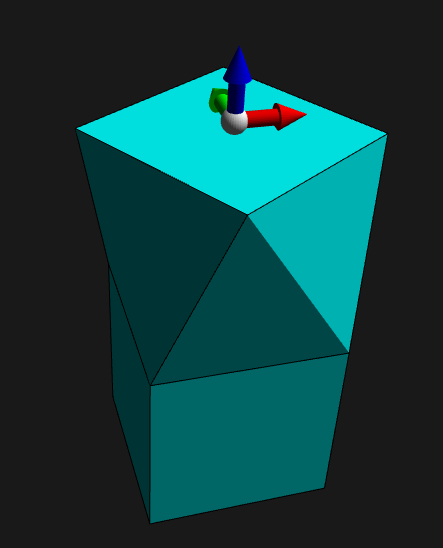
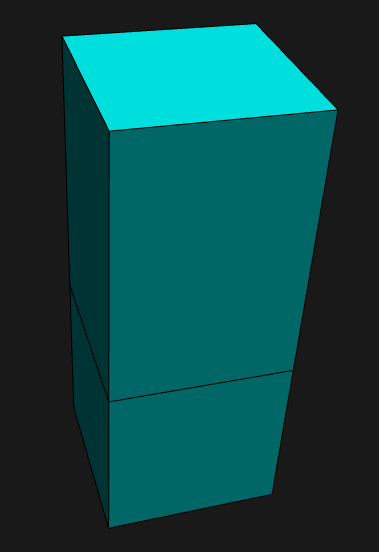
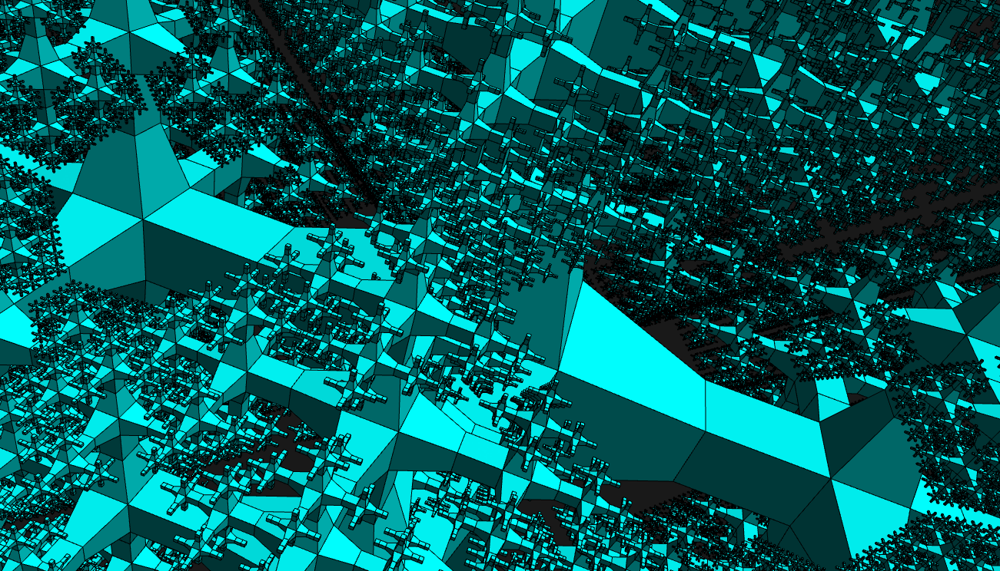
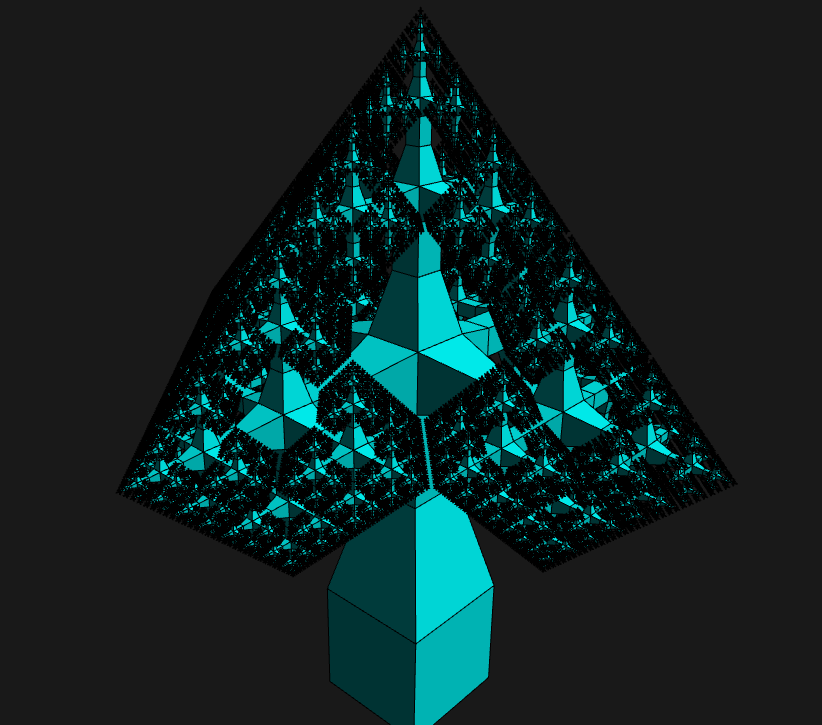
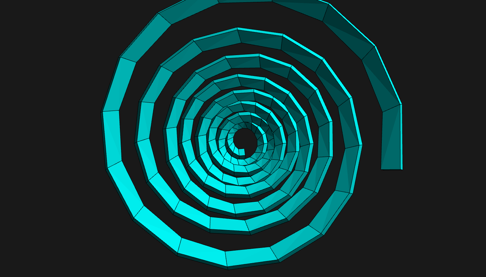
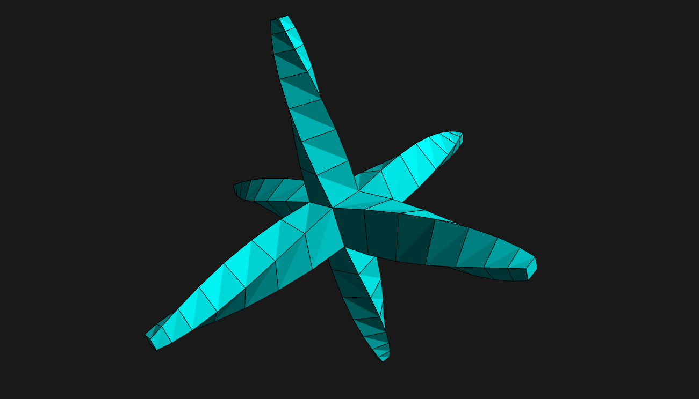

# Projet de Géométrie pour la 3D : Maillages quadrangulaires et extrusion

Le but de ce projet est de faire une application interactive de modélisation par extrusion de faces.

Il est possible de générer pour débuter la modélisation un cube à l'aide de la touche c.

Les commandes suivantes sont possibles :
* e : extrude une face

* z et shift+z : reduire et agrandire une face

* t et shift+t : tourner dans le sens anti-horaire et horaire

* haut et bas : déplacement de la face vers le haut ou vers le bas

* r : génération d'un objet récursif

* s : génération d'une spirale

* s+shift : génération d'une autre spirale

